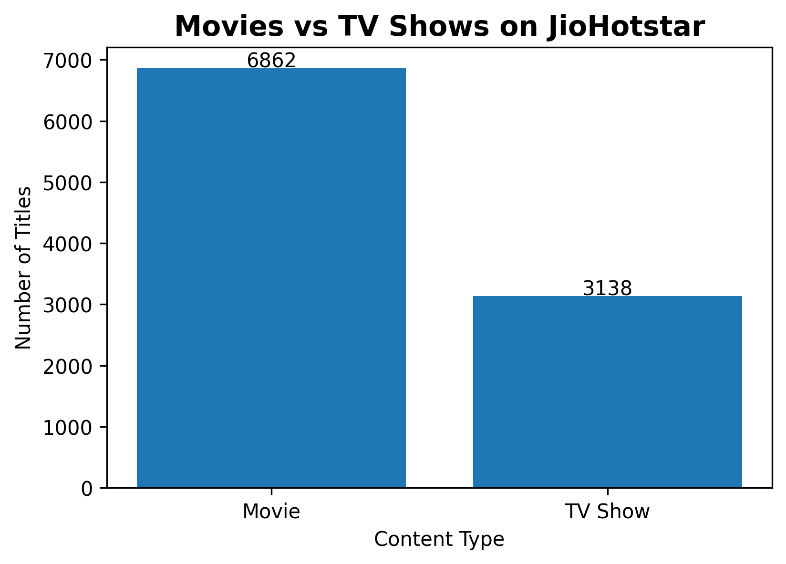
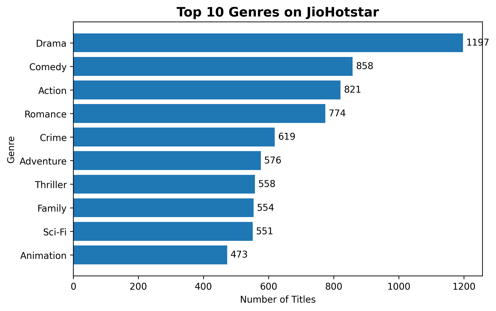
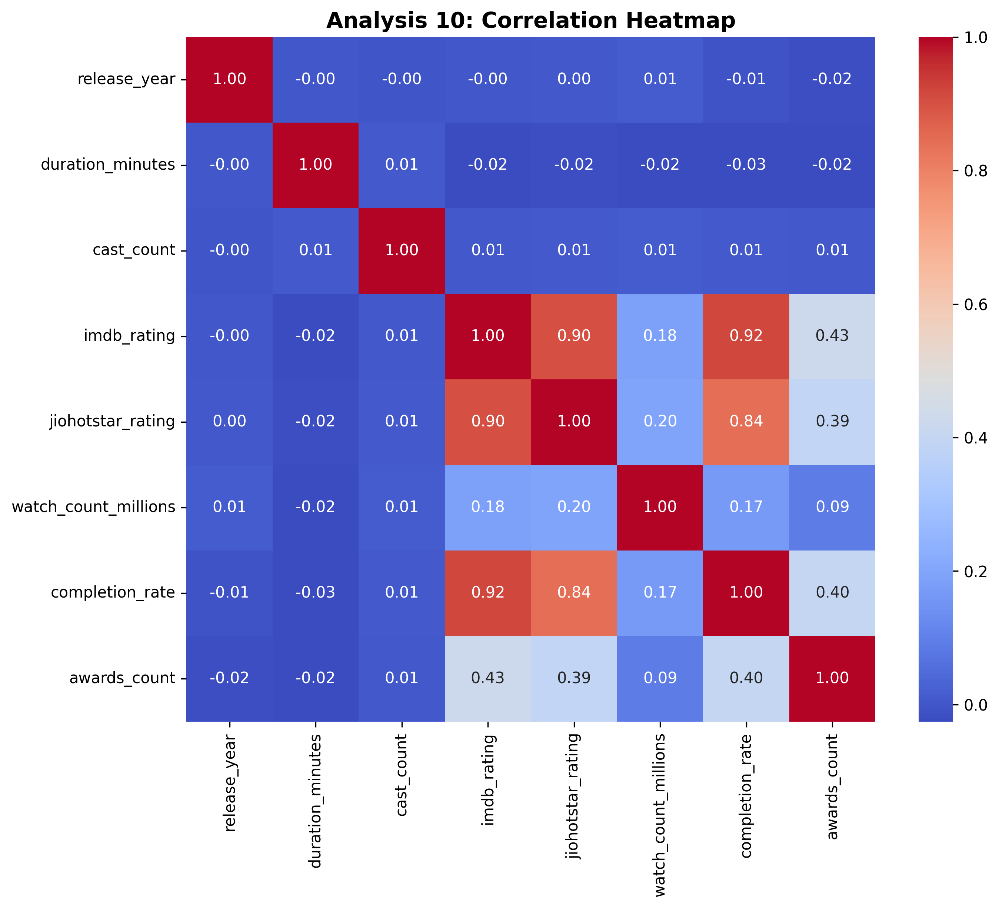

# 🎬 JioHotstar Content Analytics

End-to-End Data Analysis project using Python to analyze a fictional JioHotstar streaming platform dataset and generate business insights.


---

## 📌 Project Overview

This project analyzes a fictional streaming platform dataset to understand content distribution, audience trends, and platform performance through Exploratory Data Analysis (EDA).

The objective was to transform raw data into meaningful business insights and data-driven recommendations.

---

## 🎯 Objectives

- Clean and preprocess the dataset
- Perform Exploratory Data Analysis (EDA)
- Visualize content trends
- Discover business insights
- Recommend data-driven improvements

---

## 🛠 Tech Stack

- Python
- Pandas
- NumPy
- Matplotlib
- Seaborn
- Jupyter Notebook

---

## 📂 Project Structure

```
jiohotstar-content-analytics/
│
├── data/
├── images/
├── notebooks/
├── README.md
├── requirements.txt
└── .gitignore
```

---
## 📷 Project Preview

### Movies vs TV Shows

<p align="center">
  
</p>

### Top Genres

<p align="center">
  
</p>

### Correlation Heatmap

<p align="center">
  
</p>
## 📊 Analyses Performed

1. Movies vs TV Shows
2. Top Genres
3. Language Distribution
4. Country Distribution
5. Release Year Trend
6. IMDb Rating Distribution
7. JioHotstar Rating Distribution
8. IMDb Rating vs Watch Count
9. Movie Duration Analysis
10. Correlation Heatmap

---

## 💡 Key Business Insights

- Movies dominate the platform catalog.
- Drama is the leading genre.
- Hindi is the most common language.
- India contributes the majority of content.
- Higher-rated content generally has better completion rates.
- Ratings alone do not guarantee higher watch counts.

---

## 🚀 How to Run

1. Clone the repository
2. Install dependencies

```bash
pip install -r requirements.txt
```

3. Open the notebook inside the `notebooks` folder.
4. Run all cells.

---

## 📈 Future Improvements

- Interactive Power BI Dashboard
- Predictive Machine Learning models
- Recommendation System
- Advanced Business Analytics

---

## 👨‍💻 Author

**Koushik Meda**

B.Tech-(csbs)
